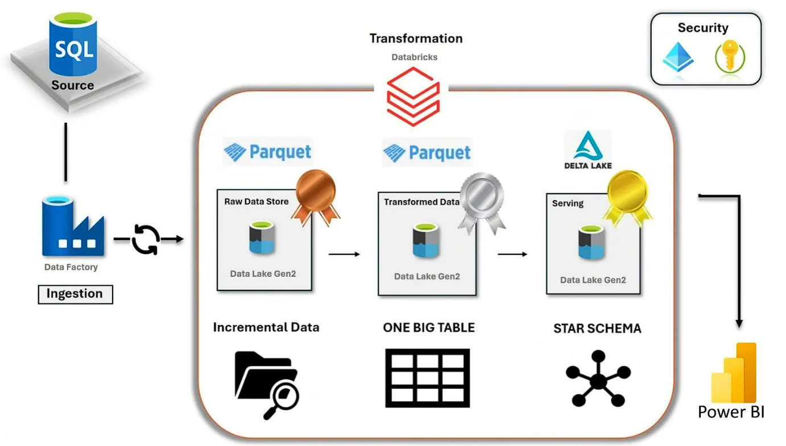

# Sales Data Engineering Project

## Project Overview

Built an incremental ETL pipeline that ingests only new and updated records from source systems into a Medallion Architecture (Bronze, Silver, Gold), reducing processing time and storage costs compared to full refresh loads.

## Business Problem

The source sales dataset receives new transactions daily. Performing a full reload of millions of records each day is inefficient and increases compute costs.

## Architecture

## Technology Used
1. Programming Language - Pyspark
2. Scripting Language - SQL
3. Azure Cloud Platform
   -  Azure SQL
   -  ADLS Gen 2
   -  Azure Databricks
4. Azure Data Factory (data pipeline tool)

## Incremental Loading Strategy

The pipeline uses a watermark-based approach.

## Data Processing Flow
### Bronze Layer
 - Raw data ingestion
 - Schema preservation
 - Audit columns added

### Silver Layer
 - Deduplication
 - Null handling
 - Data quality checks
 - Standardized formats

### Gold Layer
 - Fact and dimension tables
 - Aggregation-ready datasets
 - Optimized for Power BI reporting

